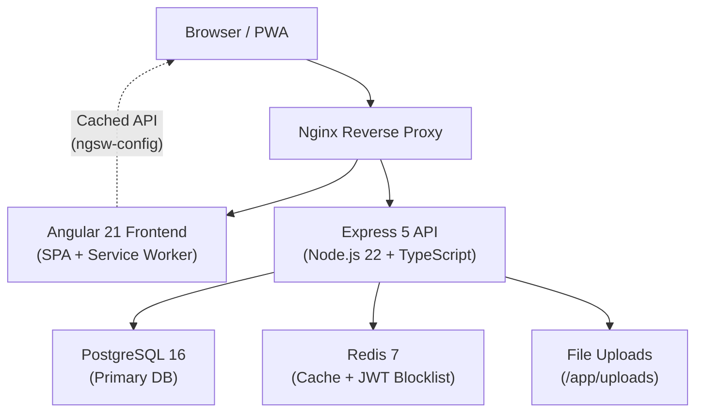

# Family Directory

A private family web application with a contact directory, family tree, calendar, and admin panel.

## Architecture Diagram



## Prerequisites

| Tool | Version |
|------|---------|
| Node.js | 22 LTS |
| npm | 10+ |
| Docker | 26+ |
| Docker Compose | v2.20+ |

## Quickstart (Development)

```bash
# 1. Clone and configure
git clone https://github.com/anujithrb/family-directory.git
cd family-directory

# 2. Copy environment file
cp .env.example .env

# 3. Start all services (DB, Redis, backend, frontend)
make dev

# 4. Run migrations and seed data
make migrate
make seed
```

Services will be available at:
- **Frontend**: http://localhost:4200
- **Backend API**: http://localhost:3000/api
- **Swagger UI**: http://localhost:3000/api/docs

**Default credentials:**
| User | Email | Password | Role |
|------|-------|----------|------|
| Admin | admin@family.local | Admin@123 | ADMIN |
| User | james@family.local | User@123 | USER |
| Read-only | emily@family.local | ReadOnly@123 | READ_ONLY |

## Production Deployment

```bash
# 1. Build production images
make build

# 2. Set production environment variables in .env
# IMPORTANT: Change all secrets!

# 3. Run database migrations
make migrate

# 4. Start production stack
make up
```

## Environment Variables

| Variable | Description | Default | Required |
|----------|-------------|---------|----------|
| `NODE_ENV` | Environment mode | `development` | No |
| `PORT` | Backend server port | `3000` | No |
| `DATABASE_URL` | PostgreSQL connection string | — | **Yes** |
| `REDIS_URL` | Redis connection string | `redis://localhost:6379` | No |
| `JWT_SECRET` | JWT signing secret (≥32 chars) | — | **Yes** |
| `JWT_REFRESH_SECRET` | Refresh token secret (≥32 chars) | — | **Yes** |
| `JWT_ACCESS_EXPIRES_IN` | Access token TTL | `15m` | No |
| `JWT_REFRESH_EXPIRES_IN` | Refresh token TTL | `7d` | No |
| `CORS_ORIGIN` | Allowed frontend origin | `http://localhost:4200` | No |
| `UPLOAD_DIR` | File upload directory | `uploads` | No |
| `MAX_FILE_SIZE` | Max upload bytes | `5242880` | No |
| `RATE_LIMIT_WINDOW_MS` | Rate limit window (ms) | `900000` | No |
| `RATE_LIMIT_MAX` | Max auth requests per window (login/register/refresh) | `5` | No |
| `LOG_LEVEL` | Winston log level | `info` | No |
| `LOG_DIR` | Directory for rotating log files | `logs` | No |
| `POSTGRES_USER` | DB username | `postgres` | No |
| `POSTGRES_PASSWORD` | DB password | — | **Yes (prod)** |
| `POSTGRES_DB` | DB name | `family_directory` | No |
| `REDIS_PASSWORD` | Redis password | — | **Yes (prod)** |

## API Endpoints

### Auth (`/api/auth`)
| Method | Path | Description |
|--------|------|-------------|
| POST | `/register` | Register new user |
| POST | `/login` | Login, returns access token + sets refresh cookie |
| POST | `/refresh` | Refresh access token |
| POST | `/logout` | Revoke tokens |
| GET | `/me` | Get current user profile |

### Family Members (`/api/family-members`)
| Method | Path | Description |
|--------|------|-------------|
| GET | `/` | List all members (search, filter) |
| POST | `/` | Create member |
| GET | `/:id` | Get member detail |
| PATCH | `/:id` | Update member |
| DELETE | `/:id` | Delete member (admin only) |
| POST | `/:id/photo` | Upload profile photo |

### Relationships (`/api/relationships`)
| Method | Path | Description |
|--------|------|-------------|
| GET | `/member/:memberId` | Get relationships for a member |
| POST | `/` | Add relationship |
| DELETE | `/:id` | Remove relationship |

### Family Tree (`/api/family-tree`)
| Method | Path | Description |
|--------|------|-------------|
| GET | `/` | Get full tree (cached) |

### Events (`/api/events`)
| Method | Path | Description |
|--------|------|-------------|
| GET | `/` | List events (filter by month/year/type) |
| POST | `/` | Create event |
| GET | `/:id` | Get event detail |
| PATCH | `/:id` | Update event |
| DELETE | `/:id` | Delete event (admin only) |

### Users (`/api/users`) — Admin only
| Method | Path | Description |
|--------|------|-------------|
| GET | `/` | List all users |
| GET | `/:id` | Get user |
| PATCH | `/:id/role` | Update user role |
| PATCH | `/:id/active` | Toggle user active status |
| GET | `/:id/permissions` | List user permissions |
| POST | `/:id/permissions` | Grant permission |
| DELETE | `/:id/permissions` | Revoke permission |

### Files (`/api/files`)
| Method | Path | Description |
|--------|------|-------------|
| GET | `/:filename` | Serve an uploaded file by filename |

### Health (`/api/health`)
| Method | Path | Description |
|--------|------|-------------|
| GET | `/` | Check DB + Redis health |

## Makefile Targets

```bash
make dev          # Start development stack
make build        # Build production Docker images
make up           # Start production stack
make down         # Stop all services
make logs         # Tail container logs
make migrate      # Run DB migrations
make seed         # Seed the database
make test         # Run all tests
make clean        # Remove volumes and images
make shell-backend  # Shell into backend container
make shell-db       # Open psql shell
make pwa-assets     # Generate PWA icons/splash screens
```

## Security

### CSRF Protection
The API uses the **double-submit cookie pattern** compatible with Angular's built-in `HttpClientXsrfModule`:
1. `GET` requests receive an `XSRF-TOKEN` cookie (readable by JavaScript)
2. State-changing requests (`POST`, `PATCH`, `DELETE`, etc.) must include an `X-XSRF-TOKEN` header whose value matches the cookie
3. Auth endpoints (`/api/auth/*`) are exempt — they rely on `httpOnly` cookies
4. Requests using a `Bearer` token are also exempt (Bearer auth is not CSRF-vulnerable)

### Rate Limiting
Two separate rate limiters are in place:

| Limiter | Applies to | Window | Default max |
|---------|-----------|--------|-------------|
| Global | All API routes (except `/api/docs`) | `RATE_LIMIT_WINDOW_MS` | 1000 requests |
| Auth | `/api/auth/register`, `/login`, `/refresh` | `RATE_LIMIT_WINDOW_MS` | `RATE_LIMIT_MAX` (default 5) |

## PWA Notes

- Service worker registers on HTTPS or `localhost` only
- For local device testing: use `mkcert` for a local certificate
- `ngsw-worker.js` is served with `Cache-Control: no-cache`
- Profile photos cached 7 days for offline rendering

## Troubleshooting

### Port already in use
```bash
lsof -i :3000 | awk 'NR>1 {print $2}' | xargs kill -9
```

### Database connection failed
```bash
docker compose logs postgres
# Check DATABASE_URL in .env matches postgres service
```

### Migrations fail
```bash
make shell-backend
npx prisma migrate reset  # WARNING: destroys data
```

### Redis connection refused
```bash
docker compose logs redis
# Ensure REDIS_URL=redis://redis:6379 (not localhost)
```

### PWA service worker not updating
Open Chrome DevTools → Application → Service Workers → click "Update" or "Unregister"

### Docker build fails with node_modules error
```bash
make clean
make dev
```

## Known Limitations

- Photo storage is local volume (not S3) — not suitable for multi-instance production
- Family tree uses force-directed D3 layout; large trees (>200 nodes) may be slow
- iCal RRULE stored as string; complex recurrence patterns are not parsed on the frontend

## Future Improvements

- S3-compatible object storage for photos
- WebSocket push notifications for new family events
- GEDCOM import/export for migration from other genealogy tools
- Email verification and password reset flows
- Two-factor authentication
